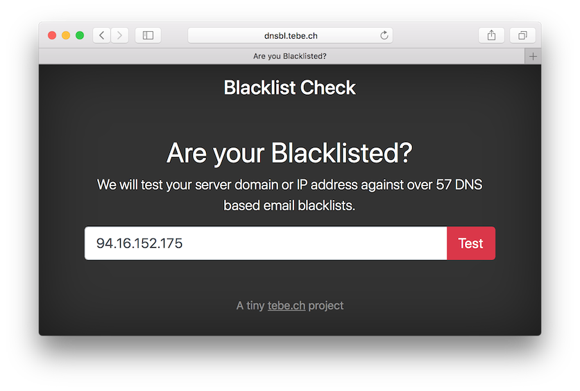

# DNS Blacklist Check

DNSBL is a simple demo project using Vue.js and Server Sent Events (SSE).
It checks if the given IP address or hostname is blacklisted on the configured dnsbl servers.

## Prerequisites

- PHP >= 5.6
- Node & NMP

## Install

~~~bash
git clone https://github.com/tbreuss/dns-blacklist-check.git
cd dns-blacklist-check
npm install
~~~

## Start

Start the internal PHP server with port 9090 and the client with port 8081.

~~~
npm run start
~~~

## Demo

Visit a demo website at <https://dnsbl.tebe.ch>
